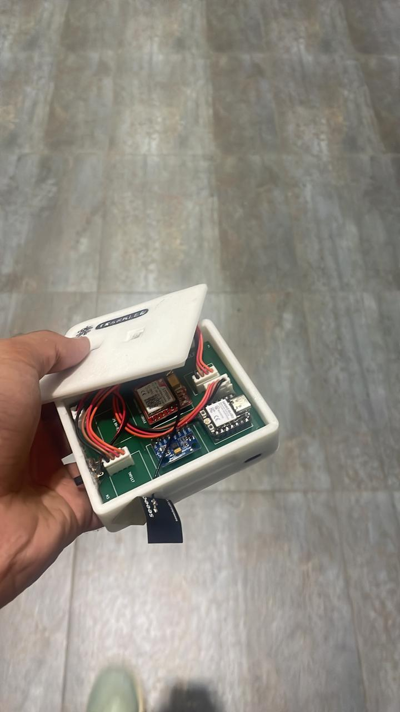
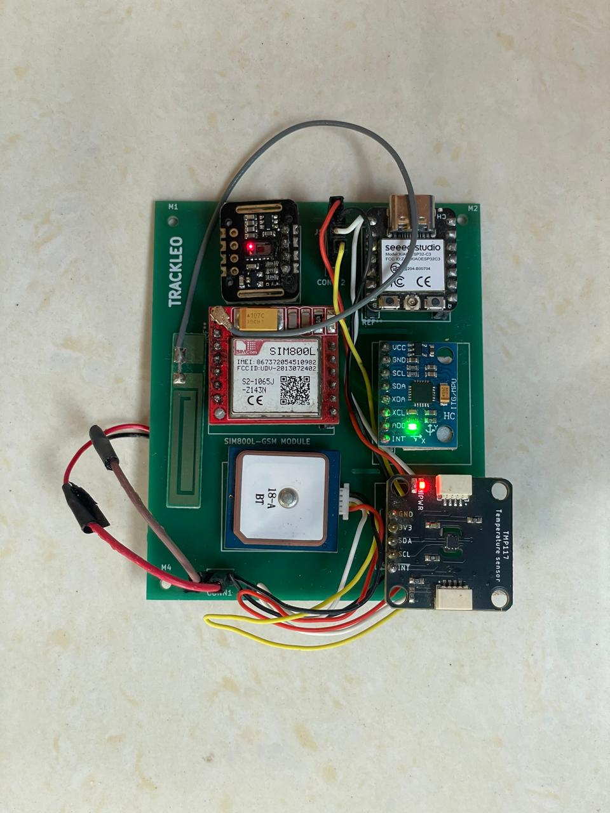
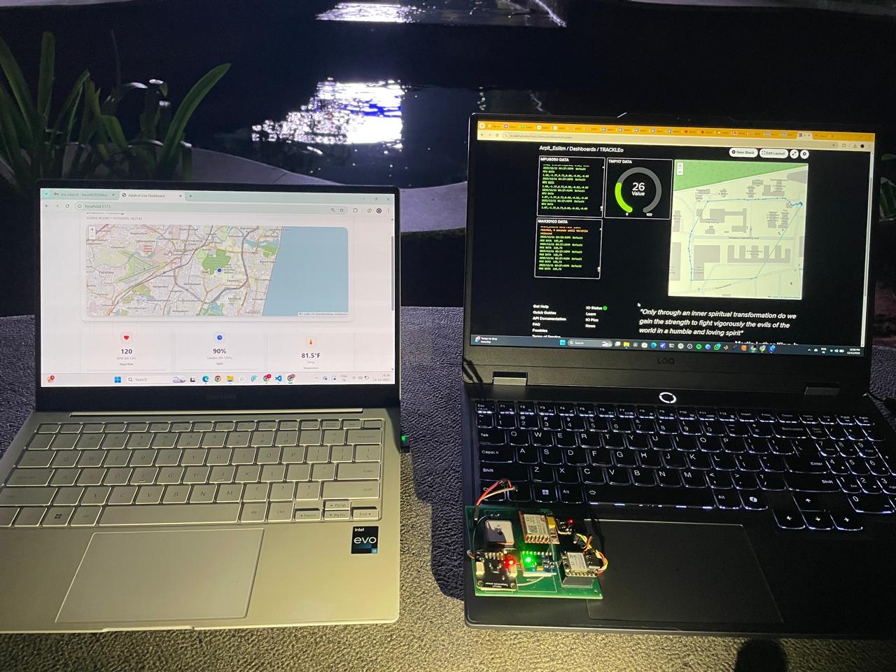
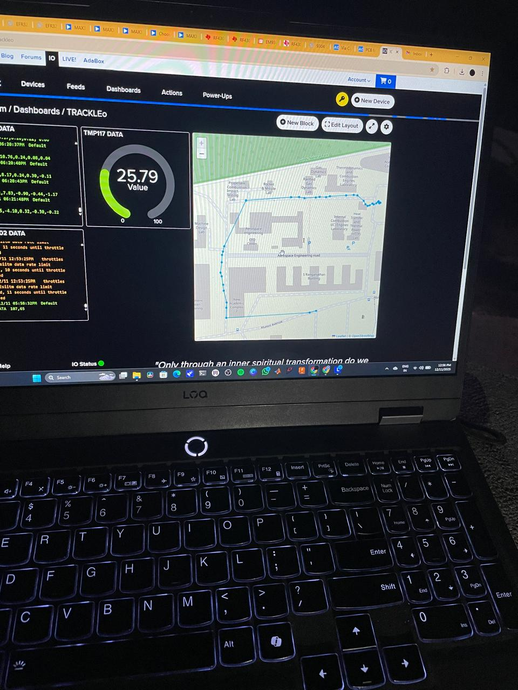
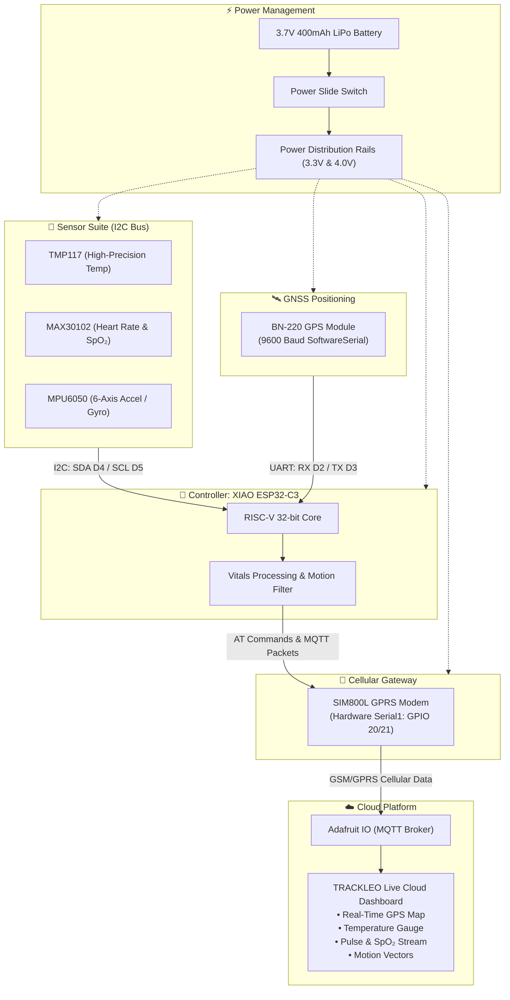
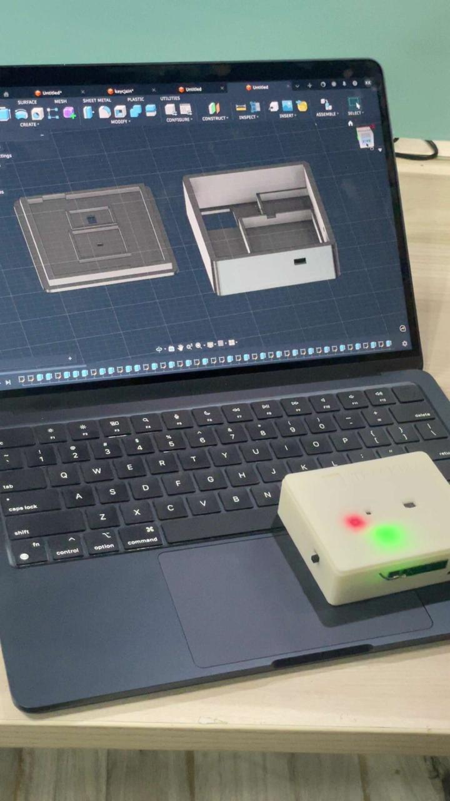
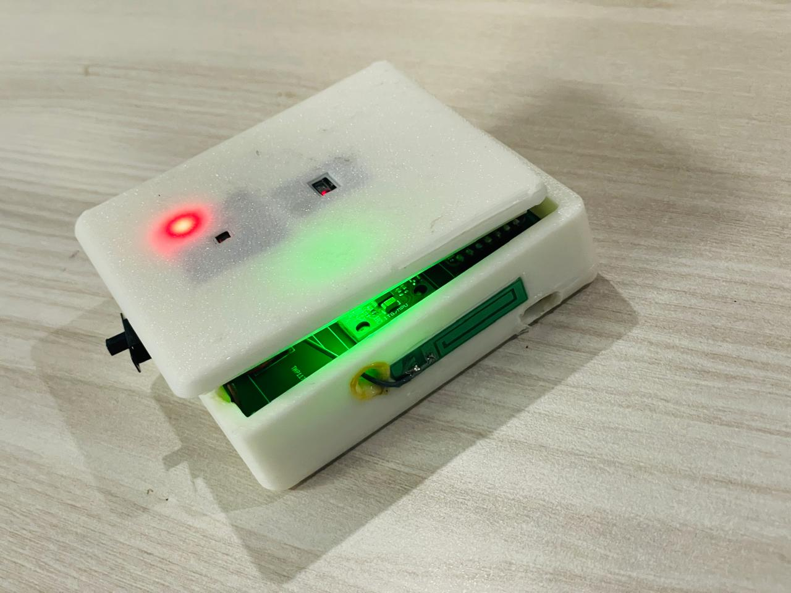
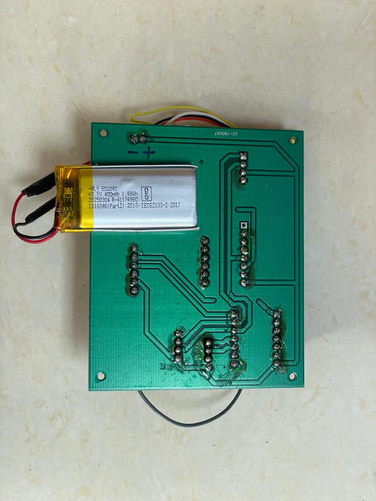
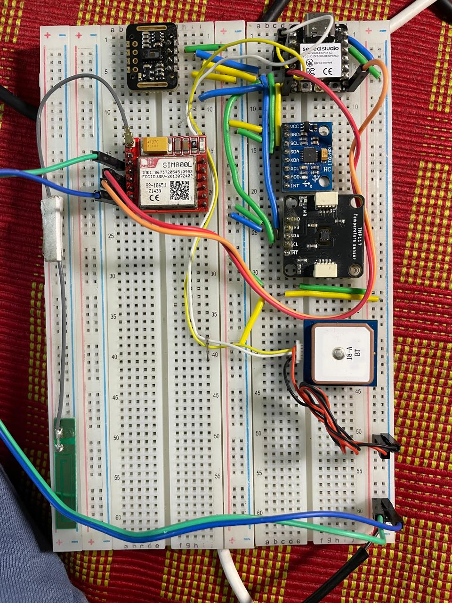
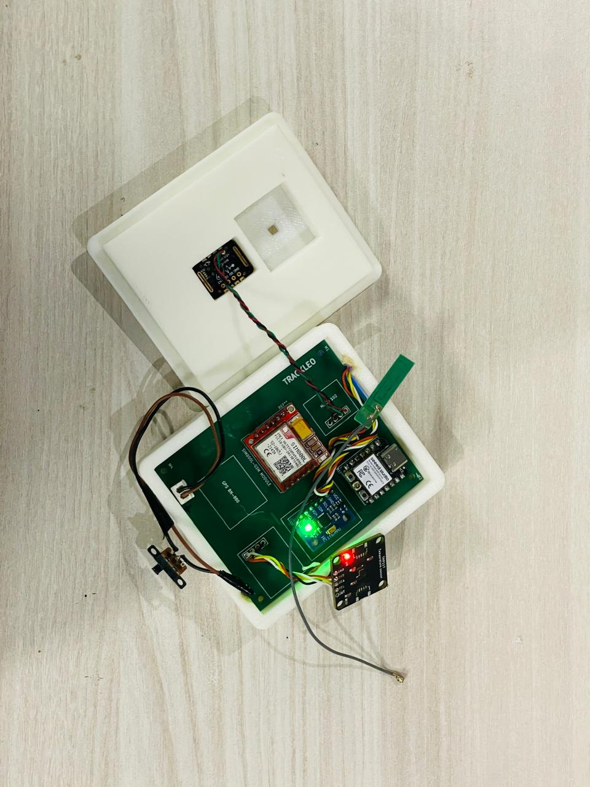

# 🛰️ TRACKLEO: Smart Wearable Health & GPS IoT Band

[](https://www.seeedstudio.com/Seeed-XIAO-ESP32C3-p-5431.html)
[](https://www.simcom.com)
[](http://mqtt.org/)
[](https://io.adafruit.com/)
[](#hardware-bill-of-materials)
[](LICENSE)

An ultra-compact, wearable remote patient monitoring and asset tracking device powered by the **Seeed Studio XIAO ESP32-C3**. **TRACKLEO** integrates clinical-grade body temperature sensing (**TMP117**), photoplethysmography heart rate & SpO₂ monitoring (**MAX30102**), 6-DOF inertial motion tracking (**MPU6050**), and satellite positioning (**BN-220 GPS**), transmitting real-time encrypted telemetry over cellular networks via **SIM800L GSM/GPRS** to the **Adafruit IO** IoT cloud.

---

## 📸 Project Showcase

<p align="center">
  
  
</p>

<p align="center">
  
  
</p>

---

## 📑 Table of Contents

- [Overview](#overview)
- [System Architecture](#system-architecture)
- [Key Features](#key-features)
- [Hardware Bill of Materials (BOM)](#hardware-bill-of-materials-bom)
- [Pinout & Wiring Diagram](#pinout--wiring-diagram)
- [Sensor Specifications & Algorithms](#sensor-specifications--algorithms)
- [MQTT Feeds & Data Schema](#mqtt-feeds--data-schema)
- [Custom PCB & 3D Enclosure](#custom-pcb--3d-enclosure)
- [Firmware Setup & Installation](#firmware-setup--installation)
- [Hardware Troubleshooting](#hardware-troubleshooting)
- [Gallery](#gallery)
- [License & Acknowledgments](#license--acknowledgments)

---

## 🌟 Overview

Traditional wearable trackers rely heavily on local Wi-Fi or Bluetooth smartphone tethering. **TRACKLEO** operates as an independent, standalone, cellular-connected telemetry node. It is designed for:
- **Remote Patient & Elderly Care**: Continuous vitals monitoring (skin temperature, pulse rate, oxygen saturation, fall detection).
- **Lone Worker & Field Safety**: Real-time GPS location telemetry combined with motion and fall detection.
- **Smart Healthcare IoT**: Secure MQTT telemetry publishing directly to cloud dashboards and healthcare APIs.

---

## 🏗️ System Architecture



---

## 🚀 Key Features

- **RISC-V Microarchitecture**: Powered by the Seeed Studio XIAO ESP32-C3 with ultra-low power consumption and tiny thumb-sized form factor.
- **Precision Temperature**: Texas Instruments TMP117 with 16-bit resolution (±0.1°C medical accuracy without calibration).
- **Photoplethysmography (PPG)**: Maxim MAX30102 optical sensor with red and infrared LEDs providing beat detection and blood oxygen calculation (`maxim_heart_rate_and_oxygen_saturation` algorithm).
- **Kinematic & Fall Detection**: 6-axis MPU6050 tracking dynamic acceleration ($\pm 8g$) and angular rate ($\pm 500^\circ/\text{s}$).
- **Satellite Tracking**: BN-220 u-blox GNSS module with ceramic patch antenna tracking latitude, longitude, satellite count, and fix age.
- **Cellular Telemetry**: SIM800L module providing standalone cellular connectivity with automatic APN detection and network reconnect routines.
- **Cloud Dashboard**: Real-time MQTT telemetry reporting to Adafruit IO with interactive map tracking, gauges, and historical streaming.
- **Custom Hardware**: Custom 2-layer PCB with dedicated component footprints, reverse battery protection, and tailored 3D-printed enclosure.

---

## 🧰 Hardware Bill of Materials (BOM)

| Component | Description | Interface | Operating Voltage |
|:---|:---|:---:|:---:|
| **Seeed Studio XIAO ESP32-C3** | RISC-V 32-bit Microcontroller | Core MCU | 3.3V / 5V USB-C |
| **SIMCom SIM800L** | Quad-Band GSM/GPRS Module | UART (Hardware Serial1) | 3.7V - 4.2V (High Peak Current) |
| **BN-220 GPS** | High-Sensitivity GNSS Module + Patch Antenna | UART (SoftwareSerial) | 3.3V - 5.0V |
| **MAX30102** | Pulse Oximetry & Heart-Rate Sensor | I2C (`0x57`) | 3.3V |
| **TI TMP117** | High-Precision Digital Temperature Sensor | I2C (`0x48`) | 3.3V |
| **InvenSense MPU6050** | 6-Axis Accelerometer + Gyroscope | I2C (`0x68`) | 3.3V |
| **LiPo Battery** | 3.7V 400mAh Rechargeable Cell | Power | 3.7V Nominal |
| **Electrolytic / Tantalum Cap** | 100µF – 470µF (SIM800L VCC rail buffer) | Power Decoupling | > 6.3V |
| **Custom PCB** | 2-Layer "TRACKLEO" Carrier Board | Hardware | - |
| **Custom 3D Case** | PLA / PETG Enclosure with Sensor Openings | Enclosure | - |

---

## 🔌 Pinout & Wiring Diagram

The Seeed Studio XIAO ESP32-C3 features a compact 14-pin layout. The system maps hardware peripherals as follows:

```
                  Seeed Studio XIAO ESP32-C3
                        +-------------+
        (A0 / D0) GPIO2 | [ ]     [ ] | 5V
        (A1 / D1) GPIO3 | [ ]     [ ] | GND
     GPS_RX (D2) GPIO4  | [ ]     [ ] | 3V3
     GPS_TX (D3) GPIO5  | [ ]     [ ] | GPIO21 (D7) SIM800L_TX
    I2C_SDA (D4) GPIO6  | [ ]     [ ] | GPIO20 (D6) SIM800L_RX
    I2C_SCL (D5) GPIO7  | [ ]     [ ] | GPIO8  (D8)
                        +----[USB]----+
```

### 1. I2C Bus Connections (Shared Sensor Bus)
All primary biometric and inertial sensors share the I2C bus:
- **XIAO SDA (GPIO 6 / D4)** $\rightarrow$ MAX30102 `SDA`, TMP117 `SDA`, MPU6050 `SDA`
- **XIAO SCL (GPIO 7 / D5)** $\rightarrow$ MAX30102 `SCL`, TMP117 `SCL`, MPU6050 `SCL`
- **Power**: All sensors powered from the regulated `3.3V` rail and common `GND`.

### 2. SIM800L GSM/GPRS Connections
- **SIM800L TX** $\rightarrow$ XIAO **RX1 (GPIO 20 / D6)**
- **SIM800L RX** $\rightarrow$ XIAO **TX1 (GPIO 21 / D7)**
- **SIM800L VCC** $\rightarrow$ Direct to LiPo 3.7V rail or 4.0V buck regulator (with a 470µF low-ESR capacitor across VCC/GND to handle 2A transmission bursts).
- **SIM800L GND** $\rightarrow$ Common **GND**.

### 3. BN-220 GPS Module Connections
- **GPS TX** $\rightarrow$ XIAO **GPS_RX (GPIO 4 / D2)**
- **GPS RX** $\rightarrow$ XIAO **GPS_TX (GPIO 5 / D3)**
- **GPS VCC** $\rightarrow$ 3.3V / 5V
- **GPS GND** $\rightarrow$ Common **GND**

---

## 📊 Sensor Specifications & Algorithms

### 1. Clinical Temperature (TMP117)
- **Accuracy**: $\pm 0.1^\circ\text{C}$ from $-20^\circ\text{C}$ to $+50^\circ\text{C}$ (meets ASTM E1112 and ISO 80601 clinical thermometry standards).
- **Telemetry**: Published in degrees Celsius to `.../feeds/temp-data`.

### 2. Heart Rate & SpO₂ (MAX30102)
- **Optical Sensing**: Dual wavelength LED (Red @ 660nm, IR @ 880nm) with 18-bit ADC.
- **Signal Processing**:
  - Raw IR signal thresholding (`irValue > 50000`) for automatic finger presence detection.
  - Beat-to-beat delta calculation using `checkForBeat()` with 4-sample running average for heart rate smoothing.
  - Full Maxim SpO₂ algorithm (`maxim_heart_rate_and_oxygen_saturation`) applied over a 100-sample buffer.

### 3. Motion & Inertia (MPU6050)
- **Accelerometer Range**: $\pm 8g$ (configured for rapid motion and fall impact detection).
- **Gyroscope Range**: $\pm 500^\circ/\text{s}$.
- **Digital Low-Pass Filter**: 5Hz bandwidth filter to eliminate high-frequency motor or walking vibration noise.
- **Telemetry**: Formatted CSV string `ax,ay,az,gx,gy,gz` sent to `.../feeds/mpu-data`.

### 4. GNSS Positioning (BN-220)
- **Baud Rate**: 9600 bps NMEA stream.
- **Parser**: TinyGPSPlus library.
- **Fix Verification**: Position updates are filtered by satellite count and fix age (`gps.location.age() < 2000 ms`) to prevent stale coordinate drift.

---

## ☁️ MQTT Feeds & Data Schema

Data is transmitted every 3 seconds to the Adafruit IO MQTT broker (`io.adafruit.com:1883`):

| Feed Name | MQTT Topic | Payload Example | Description |
|:---|:---|:---|:---|
| **Temperature** | `Arpit_Esiitm/feeds/temp-data` | `25.79` | Ambient / skin temperature in °C |
| **GPS (CSV)** | `Arpit_Esiitm/feeds/gps-data` | `12.991234,80.234567` | Latitude, Longitude in decimal degrees |
| **GPS (JSON)** | `Arpit_Esiitm/feeds/gps-data` | `{"lat":12.991234,"lon":80.234567}` | JSON formatted GPS coordinates |
| **MPU6050** | `Arpit_Esiitm/feeds/mpu-data` | `0.15,-0.92,9.81,0.01,-0.02,0.04` | Accel ($X, Y, Z$ in $\text{m/s}^2$) & Gyro ($X, Y, Z$ in $\text{rad/s}$) |
| **MAX30102** | `Arpit_Esiitm/feeds/max-data` | `78,98` | Pulse (BPM), Oxygen Saturation (SpO₂ %) |
| **Throttle** | `Arpit_Esiitm/throttle` | *(incoming message)* | Cloud rate-limiting alert channel |

---

## 🖨️ Custom PCB & 3D Enclosure

<p align="center">
  
  
</p>

### Hardware Highlights:
1. **TRACKLEO Carrier Board**: Custom two-layer PCB designed specifically to host the Seeed Studio XIAO ESP32-C3, SIM800L module, BN-220 GPS, and sensor breakouts.
2. **Compact Form Factor**: Designed for portable, wearable deployment with battery mounting directly beneath the mainboard.
3. **Parametric Enclosure**: Modeled in Autodesk Fusion 360 with:
   - Recessed optical window for finger placement against the MAX30102 sensor.
   - Dedicated cutouts for the hardware power toggle switch.
   - Light-diffusing channels for LED status indicators.
   - External GPS antenna mount.

---

## 💻 Firmware Setup & Installation

### 1. Arduino IDE / PlatformIO Prerequisites
Install the ESP32 board definitions in Arduino IDE:
1. Go to **File** $\rightarrow$ **Preferences** $\rightarrow$ **Additional Board Manager URLs**.
2. Add: `https://raw.githubusercontent.com/espressif/arduino-esp32/gh-pages/package_esp32_index.json`
3. In **Tools** $\rightarrow$ **Board** $\rightarrow$ **Boards Manager**, search for `esp32` and install the latest version.
4. Select board: **XIAO_ESP32C3**.

### 2. Required Libraries
Install the following libraries via the Arduino Library Manager:
- `TinyGSM` by Volodymyr Shymanskyy
- `PubSubClient` by Nick O'Leary
- `TinyGPSPlus` by Mikal Hart
- `EspSoftwareSerial` by Dirk Kaar / Peter Lerup
- `Adafruit MPU6050` & `Adafruit Unified Sensor`
- `Adafruit TMP117`
- `SparkFun MAX3010x Pulse and Proximity Sensor Library`

### 3. Configuration
Open `VERSION 2.0` (or `TRACKLEO.ino`) and configure your network and cloud credentials:
```cpp
// APN Configuration (Check your GSM provider)
const char apn[] = "airtelgprs.com";
const char gprsUser[] = "";
const char gprsPass[] = "";

// Adafruit IO MQTT Settings
const char* MQTT_SERVER    = "io.adafruit.com";
const int   MQTT_PORT      = 1883;
const char* MQTT_USER      = "YOUR_ADAFRUIT_USERNAME";
const char* MQTT_PASS      = "YOUR_ADAFRUIT_AIO_KEY";
const char* MQTT_CLIENT_ID = "esp32-c3-trackleo-001";
```

### 4. Compile & Flash
1. Connect the Seeed Studio XIAO ESP32-C3 via USB-C.
2. Select the correct COM port.
3. Click **Upload** and open the Serial Monitor at **115200 baud** to view real-time diagnostics.

---

## 🔧 Hardware Troubleshooting

- **SIM800L Power Dropouts (Brownout)**:
  - GSM network registration requires bursts of up to **2.0A**. The 3.3V pin on microcontrollers *cannot* supply this current.
  - **Fix**: Power the SIM800L directly from a 3.7V LiPo battery or dedicated 4.0V regulator, and solder a **100µF–470µF low-ESR capacitor** directly across the SIM800L `VCC` and `GND` pins.
- **GPS Indoor Lock**:
  - The BN-220 GPS patch antenna requires line-of-sight to the sky. Initial "cold start" satellite acquisition can take 1–3 minutes outdoors.
- **MAX30102 Zero Readings**:
  - Ensure firm finger contact over the sensor optical window. The firmware filters out readings where `irValue <= 50000` to prevent false positive beats.

---

## 🖼️ Gallery

| Custom PCB Assembly | Under-Board Solder & LiPo |
|:---:|:---:|
|  |  |

| Breadboard Prototyping | Live IoT Field Testing |
|:---:|:---:|
|  |  |

| Enclosure Assembly | Adafruit IO Tracking Dashboard |
|:---:|:---:|
|  |  |

---

## 📄 License & Authors

This project is licensed under the MIT License - see the [LICENSE](LICENSE) file for details.

- **Developer**: Arpit ([@123Arp](https://github.com/123Arp))
- **Hardware & Firmware**: Built with Seeed Studio XIAO ESP32-C3, SIM800L, and Adafruit IO.
